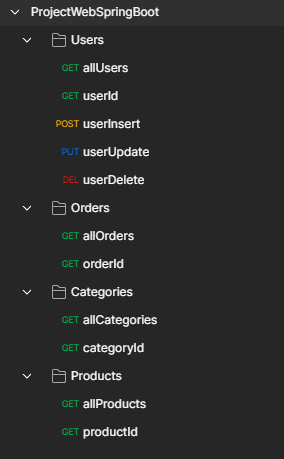
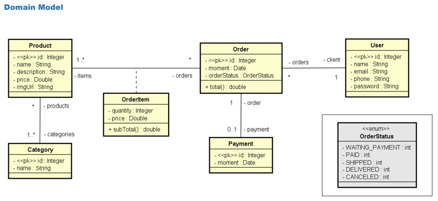

# WebSpring

### Back-end project made with Java Spring Boot, which is connected with a Postgresql Database.
### All the project was tested with Postman
### The project is deployed at the <strong>Heroku</strong>, exactly in this [link](https://java-springboot-web.herokuapp.com/)

### url routes that has in project:
- /users
- /users/{id}
- /users? (with POST method and data in body)
- /users/{id} (with PUT method and data in body)
- /users/{id} (with DELETE method)
- /orders
- /orders/{id}
- /categories
- /categories/{id}
- /orders
- /orders/{id}

### Postman Map Requests

### UML project:
